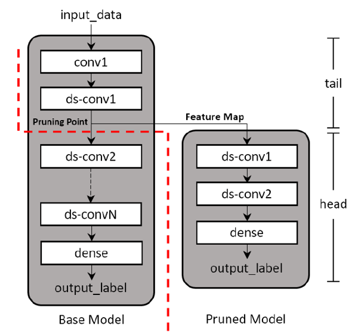
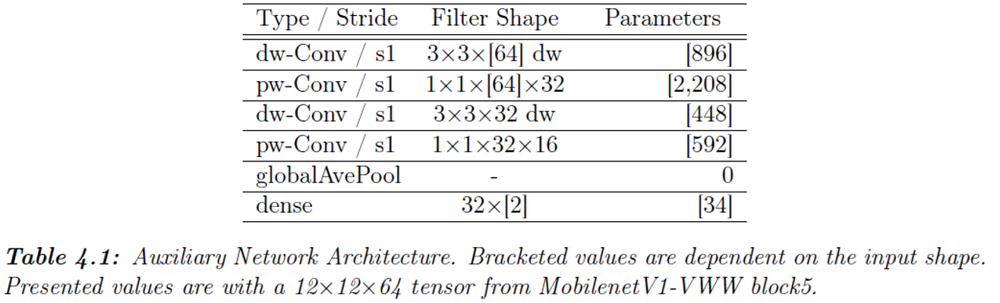
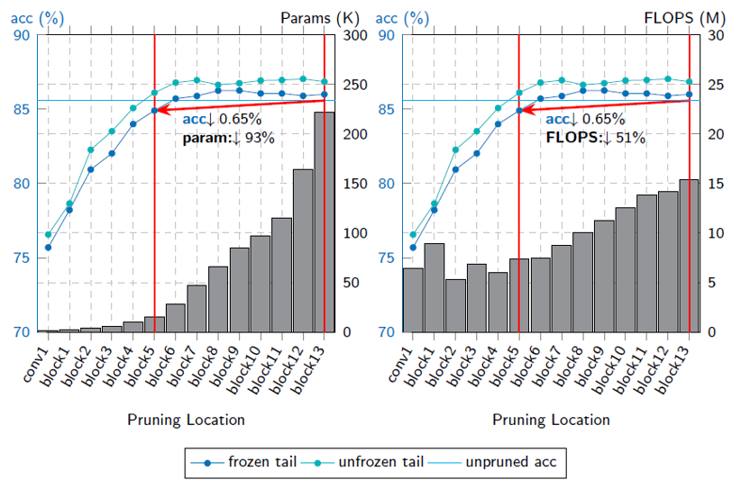
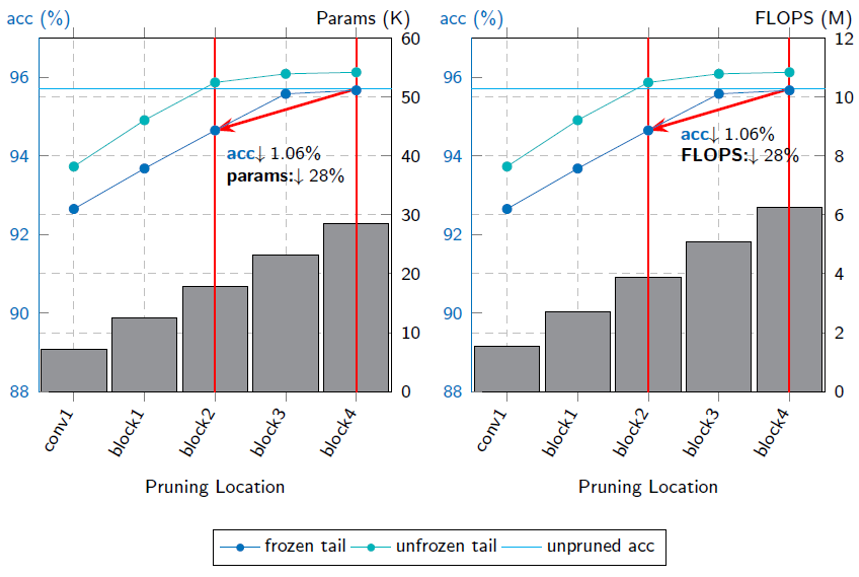
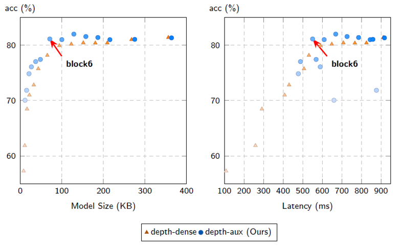
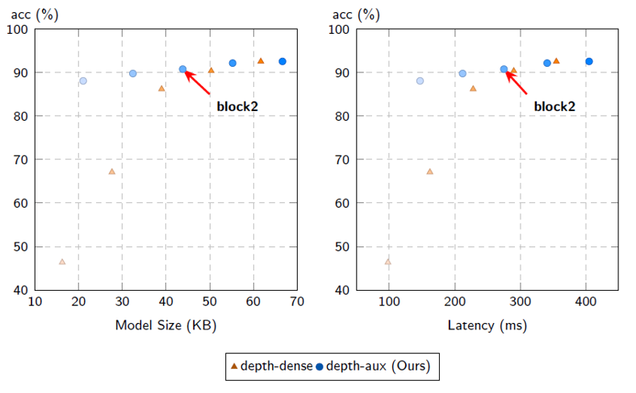

# Depth Pruning with Auxiliary Networks for tinyML

Depth pruning with Auxiliary Networks uses a small but highly efficient neural network to prune already trained models. Results show a significant reduction to compute requirements with potentially no accuracy loss.





Paper Links

* Arxiv - https://arxiv.org/abs/2204.10546

This repository contains training scripts and implementations used in the paper: Depth Pruning with Auxiliary Networks for tinyML. 

Requirements:

* Python 3.8
* TensorFlow 2.3.0

# Baseline Model Training

Base model training for Visual Wakewords and Keyword Spotting makes use of a modified verision of [MLPerf Tiny v0.5](https://github.com/mlcommons/tiny) benchmarking suite.

```
# VWW
sh mlperf-tiny/v0.5/training/visual_wake_words/download_and_train_vww.sh

# KWS
sh mlperf-tiny/v0.5/training/keyword_spotting/build_ref.sh
```

```
# VWW (for Arducam Pico4ML)
sh mlperf-tiny/v0.5/training/visual_wake_words/download_and_train_vww_gray.sh

# KWS (for Arducam Pico4ML)
sh mlperf-tiny/v0.5/training/keyword_spotting/build_ref.sh
```

# Depth Pruning Experiments
Scripts need to be modified with correct trained base model paths

```
# VWW
cd depth-pruning/vww/
sh prune_vww_mobilenet_aux.sh

# KWS
cd depth-pruning/kws/
sh prune_kws_aux_dscnn.sh
```

```
# VWW (for Arducam Pico4ML)
cd mlperf-tiny/v0.5/training/visual_wake_words/
sh prune_vww_mobilenet_aux_gray.sh
sh quantize_vww.sh

# KWS (for Arducam Pico4ML)
cd mlperf-tiny/v0.5/training/keyword_spotting/
sh prune_kws_aux_dscnn_hw.sh
sh quantize_kws_hw.sh
```

# MLPerfTiny Results
### Visual Wakewords

Pruning at block5 reduces parameters by 93% and FLOPS by 51% at a cost of 0.65% accuracy.

### Keyword Spotting

Pruning at block2 reduces parameters by 28% and FLOPS by 28% at a cost of 1.06% accuracy.

# Pruned Model Performance on Cortex-M0
### Visual Wakewords on Cortex-M0

Darker marks denote deeper pruning points. Pruning at block6 of MobilenetV1-VWW reduces model size from 336KB to 71KB and latency from 904ms to 551ms. Accuracy also increases from 80% to 81% which can be attributed to reduced overfitting.

### Keyword Spotting on Cortex-M0 

Darker marks denote deeper pruning points. Pruning at block-2 of DSCNN reduces model size from 54KB to 43KB and latency from 340ms to 275ms.

# Citation
If you find this work useful, please cite:

```
@misc{https://doi.org/10.48550/arxiv.2204.10546,
  doi = {10.48550/ARXIV.2204.10546},
  url = {https://arxiv.org/abs/2204.10546},
  author = {De Leon, Josen Daniel and Atienza, Rowel},
  keywords = {Machine Learning (cs.LG), Computer Vision and Pattern Recognition (cs.CV), FOS: Computer and information sciences, FOS: Computer and information sciences},
  title = {Depth Pruning with Auxiliary Networks for TinyML},
  publisher = {arXiv},
  year = {2022},
  copyright = {Creative Commons Attribution Non Commercial Share Alike 4.0 International}
}

```